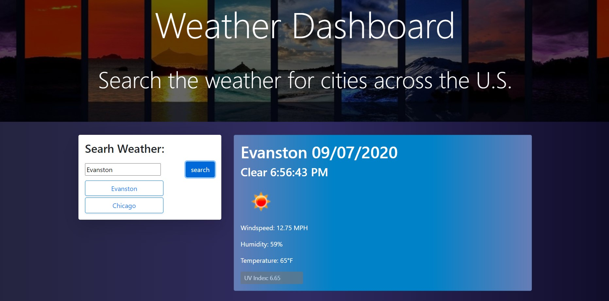
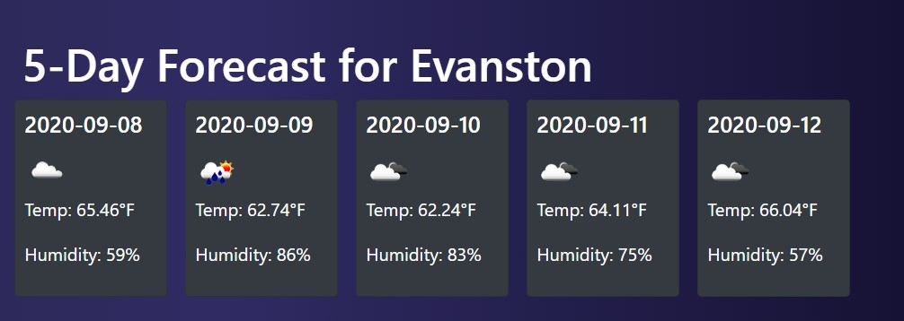

# Weather Dashboard

## Getting Started
Get the weather in your local city with this. Using an API call from OpenWeatherAPI you are able to get wind speed, temperature, humidity and UV Index. You are also able to get a 5 day forecast. Just type in the City name and it will all appear dynamically. The JavaScript libraries that are used are AJAX and jQuery. HTML is used to be able to position where everything is going to go once it all appears on screen.

## A Forecast for the next five days

## Deployment
https://icek567.github.io/Weather/
 
### Authors
Sergio Perez

